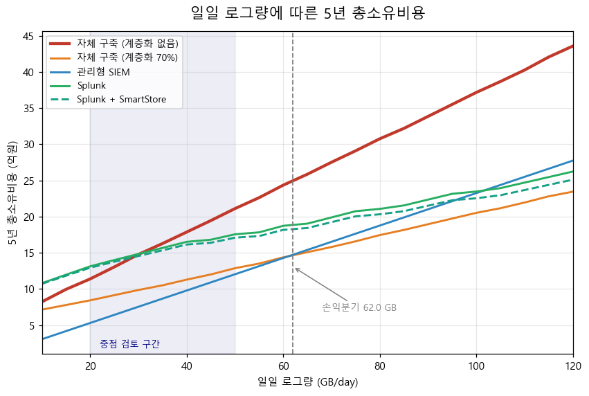
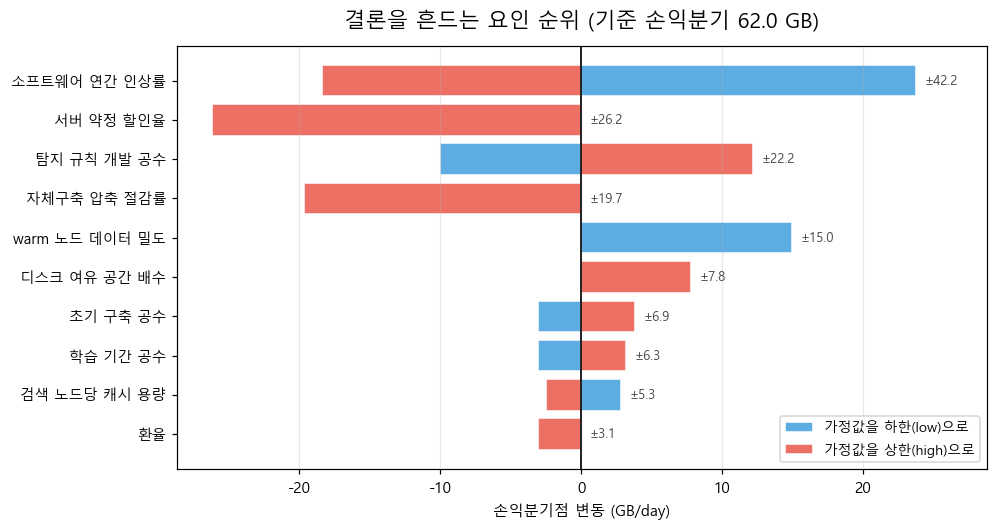
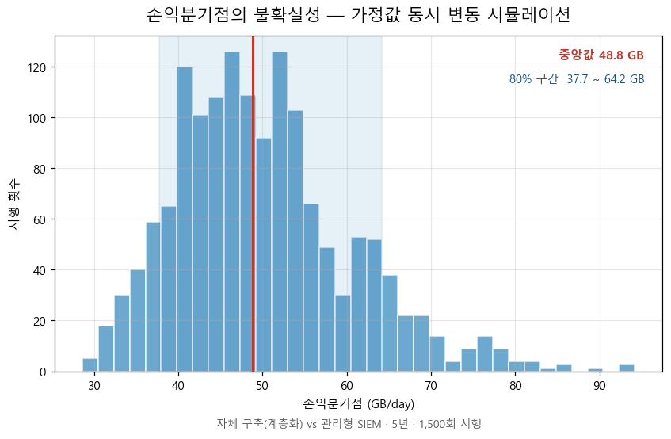
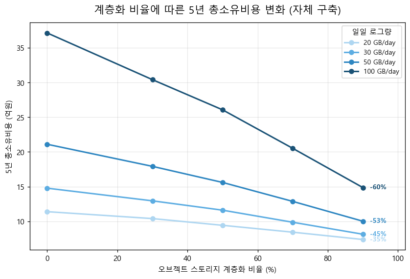
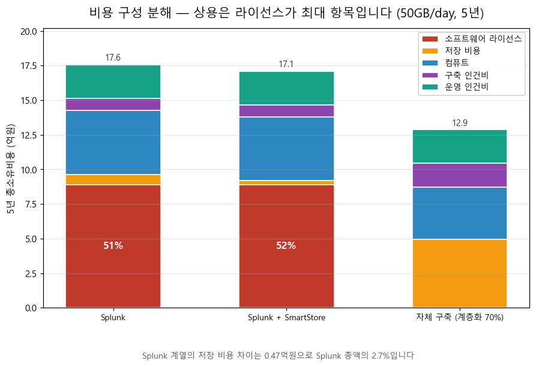

# SIEM 자체 구축 vs 구매 — 총소유비용 분석

> **[Read in English / 영문으로 읽기 →](README.md)**

---

## 이 프로젝트는 무엇인가

고객 데이터를 다루는 기업은 보안 기록(로그)을 수집하고 보관해야 합니다. 그 기록을 실제로 활용하려면 **SIEM**이라는 시스템이 필요합니다. 서버와 네트워크 장비가 남기는 접속 기록을 한곳에 모아 이상 징후를 찾아내는 소프트웨어입니다.

이 시스템을 확보하는 방법은 두 가지입니다. 무료로 공개된 오픈소스로 **직접 만들거나**, 완성된 제품을 **구매하는** 것입니다. 소프트웨어 값이 들지 않으니 직접 만드는 쪽이 당연히 저렴해 보입니다.

본 프로젝트는 그 통념이 실제로 맞는지 확인합니다.

> **"오픈소스로 직접 만들면 되는데, 왜 굳이 사야 합니까?"**

답은 단순한 예·아니오가 아닙니다. 하루에 발생하는 로그의 양에 따라 달라집니다. 본 프로젝트는 두 방식의 비용이 같아지는 지점을 찾는 계산 도구를 만들고, 그 지점이 무엇에 좌우되는지를 보여줍니다.

**결과물은 결론이 아니라 도구입니다.** 만약 분석 결과 자체 구축이 항상 유리하다고 나왔다면, 그 결과를 그대로 보고했을 것입니다. 불리한 결과를 감추면 분석 자체의 의미가 사라지기 때문입니다.

---

## 요약된 답

| 조건 (5년 계약 기준) | 권고 |
|---|---|
| 약 37GB/day 미만 | **구매.** 인건비 부담이 라이선스 절감액을 넘어섭니다 |
| 37~56GB/day | **조건부.** 조직의 내부 역량에 따라 답이 갈립니다 |
| 약 56GB/day 초과 | **자체 구축이 유리할 수 있으나**, 한 가지 전제가 필요합니다 |

**그 전제가 본 프로젝트에서 가장 중요한 발견이었습니다.** 자체 구축이 경쟁력을 갖는 것은 저장 공간을 **계층화**했을 때에 한합니다. 오래된 데이터를 값비싼 고성능 디스크에 계속 두지 않고 저렴한 저장소로 내리는 설계를 말합니다. 계층화하지 않은 자체 구축은 분석한 전 구간(하루 5~200GB)에서 모든 상용 제품에 밀렸습니다. **단 한 번도 이기지 못했습니다.**

놓치기 쉬운 두 번째 조건도 있습니다. **계약 기간**입니다. 3년 계약에서는 손익분기점이 약 123GB/day로 이동하는데, 이는 대부분의 중견기업이 다루는 범위를 크게 벗어난 값입니다.

---

## 분석은 어떻게 만들어졌는가

프로젝트는 단계별로 진행되었습니다. 각 단계는 **앞 단계가 답하지 못한 질문 때문에 생겨났습니다.** 이 장은 그 연결 고리를 따라갑니다.

### 0단계 — 무엇을 비교할지 정하기

계산에 앞서 범위를 확정해야 했습니다. 어떤 선택지를 비교할지, 무엇을 기준으로 잴지, 어느 기간을 볼지입니다.

여기서 내린 두 가지 결정이 이후에 중요해졌습니다.

**측정 기준은 일일 로그량(GB/day)입니다.** 회사 규모나 직원 수가 아닙니다. 로그량이 저장 비용과 처리 비용을 동시에 좌우하므로, 답을 실제로 움직이는 변수이기 때문입니다.

**3년과 5년을 모두 계산합니다.** 자체 구축은 비용이 앞쪽에 몰려 있습니다. 구축 작업 대부분이 첫해에 일어나기 때문입니다. 만약 한 기간만 사용했다면 **결론이 분석 결과가 아니라 기간 선택에 좌우**되었을 것입니다. 이 조치는 실제로 필요했던 것으로 드러났습니다. 두 기간의 손익분기점이 2.8배 차이 났기 때문입니다.

→ *범위는 정해졌습니다. 그런데 "얼마가 드는가"는 누가 묻느냐에 따라 다릅니다. 다음 단계가 필요해진 이유입니다.*

### 1단계 — 대상 조직 파악하기

분석 대상은 국내 이커머스 중견기업입니다. 이런 조직의 세 가지 특성이 계산 전체를 좌우합니다.

**로그를 2년간 보관해야 합니다.** 국내 규정상 5만 명 이상의 개인정보를 처리하는 기업은 접속 기록을 최소 2년간 보관해야 합니다. **이 한 가지 사실 때문에 해외에서 발표된 대부분의 SIEM 비용 분석을 그대로 쓸 수 없습니다.** 해외 자료는 통상 90일에서 1년 보관을 전제하기 때문입니다. 보관 기간이 두 배가 되면 저장 용량도 두 배가 됩니다.

**보안 인력 비중은 기업마다 크게 다릅니다.** 동종 업계 6개사의 공시 자료를 확인한 결과, 보안 전담 인력이 IT 인력의 1.5%에서 7.1%까지 분포했습니다. 가장 규모가 큰 기업이 가장 높은 비율을, 중견 기업이 가장 낮은 비율을 보였습니다. 즉 이 비율은 회사 크기가 아니라 **보안 투자 의지**를 반영합니다. 평균을 내면 어느 기업의 현실과도 맞지 않는 숫자가 나오므로 범위로 처리했습니다.

**한 가지는 끝내 알아낼 수 없었습니다. 그런 기업이 실제로 하루에 로그를 얼마나 만들어내는지입니다.** 추정하려면 다섯 단계의 가정을 이어 붙여야 했습니다(방문자 수 → 페이지뷰 → API 호출 → 로그 발생 → 총량). 그런데 이런 연쇄에서는 오차가 더해지는 것이 아니라 **곱해집니다.** 각 단계에서 2배씩만 틀려도 최종 오차는 32배가 됩니다.

그래서 로그량은 추정하지 않고 **사용자가 입력하는 변수로 두었습니다.** 이 결정이 프로젝트 전체의 성격을 바꿨습니다. 결과물이 하나의 숫자를 담은 보고서가 아니라 **계산 도구**가 된 것입니다.

→ *누구를 위한 계산인지 정해졌습니다. 다음 질문은 "무엇을 비용으로 볼 것인가"입니다.*

### 2단계 — 무엇을 비용으로 셀지 정하기

비용을 네 덩어리로 나누었습니다. 이 분류는 임의로 정한 것이 아니라 **질문의 구조를 그대로 반영합니다.**

| 덩어리 | 유리한 쪽 | 발생 시점 |
|---|---|---|
| 소프트웨어 라이선스 | 자체 구축 (오픈소스는 무료) | 매년 |
| 데이터 보관 | 규모에 따라 다름 | 매년 |
| 구축 인건비 | 구매 (제조사가 대신 수행) | 1회성 |
| 운영 인건비 | 구매 | 매년 |

**두 덩어리는 구매가, 한 덩어리는 자체 구축이 유리하고, 나머지 하나는 규모에 따라 뒤집힙니다.** 그 합계가 역전되는 지점이 바로 손익분기점입니다. 총액 하나로 뭉치지 않고 덩어리를 분리한 덕분에, 나중에 "인건비를 빼고 보면 어떤가" 같은 질문에도 답할 수 있게 되었습니다.

보관과 운영 덩어리에 들어간 세 항목은 **국내 규제 때문에만 존재합니다.** 2년 보관, 백업 이중화, ISMS 심사 대응입니다. 해외 분석 자료에는 아예 없는 칸입니다.

**두 항목은 의도적으로 제외했습니다.** 기회비용은 운영 인건비와 중복되어 이중 계상이 되고, 보안 사고 리스크 비용은 사고 확률을 모르는 상태에서 계산할 수 없기 때문입니다. 억지로 만들어 넣는 대신 뒤 단계로 미뤘습니다.

→ *셀 항목이 정해졌습니다. 이제 실제 가격이 필요합니다.*

### 3단계 — 가격 수집, 그리고 벽

클라우드 저장소와 서버 가격은 공개되어 있어 어렵지 않았습니다. 서울 리전 단가를 공식 가격표에서 직접 확인했습니다.

**벽에 부딪힌 것은 국내 관리형 SIEM 가격이었습니다.** 어느 업체도 공개하지 않습니다.

공공기관 입찰 자료가 가장 근접한 대안으로 보여, 정부 기관 제안요청서 5건을 전수 확인했습니다. **그런데 5건 모두 데이터 용량에 관한 수치가 전혀 없었습니다.** 왜 그런지 파고든 결과 두 가지를 알게 되었고, 둘 다 유용했습니다.

**첫째, 법령에 의해 비공개였습니다.** 문서에는 "시스템 구성도", "정보화 현황" 같은 절이 실제로 존재합니다. 그런데 내용이 삭제되고, 「행정기관 및 공공기관 정보시스템 구축·운영 지침」 제17조에 따라 공개하지 않으며 기관 방문 후 보안서약서를 제출해야 열람 가능하다는 안내로 대체되어 있었습니다. 즉 국내 가격을 찾지 못한 것은 조사 실패가 아니라 **구조적 조건**이었습니다. 그리고 이는 대안으로 택한 방법 — 공개된 해외 가격에서 역산하는 것 — 이 편의가 아니라 **명문 근거를 갖게 되었다**는 뜻이기도 합니다.

**둘째, 국내 계약은 애초에 데이터 용량 기준이 아니었습니다.** 인력 수 기준이었습니다.

| 기관 | 계약 기준 | 연 환산 | 1인당 |
|---|---|---|---|
| 대검찰청 | 13명 상주 | 12.1억원 | 약 9,300만원 |
| 한국은행 | 최소 26명 | 37.7억원 | 약 1억 4,500만원 |

이 범위(1인당 9,300만~1억 4,500만원)는 국가 임금 통계에서 **독립적으로** 산출한 인건비(9,301만~1억 2,177만원)와 거의 정확히 겹칩니다. 통계로 얻은 숫자가 실제 계약으로 확인된 셈으로, 계획하지 않았던 교차 검증이 이루어졌습니다.

→ *가격은 모았습니다. 그런데 "로그 50GB"를 "디스크 몇 TB"로 바꾸는 것부터가 별개의 문제였습니다.*

### 3b단계 — 로그가 실제 디스크가 되기까지

고객이 "하루 50GB가 발생한다"고 말할 때, 그것이 곧 디스크 50GB를 뜻하지는 않습니다. 그 사이에 세 번의 변환이 일어납니다.

**압축과 색인.** 원본 로그는 압축되어 약 15% 크기가 되지만, 검색을 위한 색인이 약 35%를 다시 더합니다. 합하면 원본의 약 50%입니다.

**복제.** 장애에 대비해 사본을 둡니다. 여기서 수정이 필요했습니다. 처음 모델은 전체에 하나의 복제 계수를 곱했는데, 실제 시스템에서는 **원본과 색인이 서로 다른 계수로 복제**됩니다. 두 값이 다르게 설정되는 구성이 흔하며, 이를 하나로 뭉치면 저장량을 과대 산정하게 됩니다. 계산식을 분리했습니다.

**아카이브 전환.** 오래된 데이터는 색인을 버리고 약 15%로 줄어듭니다. 대신 그 구간은 즉시 검색이 불가능해집니다.

이 계수들은 제조사 공식 문서로 검증했습니다. 예를 들어 하루 100GB를 1년 보관하면 최근 구간 1.5TB, 중간 구간 3TB, 아카이브 약 4TB가 됩니다.

**여기서 두 번째 수정도 필요했습니다.** 오픈소스 검색엔진 계열은 정반대로 동작합니다. 원본보다 작아지는 것이 아니라 오버헤드가 붙어 약 15% **커집니다.** 한쪽은 데이터를 줄이고 다른 쪽은 늘리는 것입니다. 두 계수 체계를 혼동하면 이후 모든 숫자가 조용히 틀어지므로, 계산 경로를 아예 다른 함수로 분리하고 **두 경로가 같은 결과를 내면 실패하는 검증**을 넣었습니다.

→ *이제 용량을 구할 수 있고 단가도 있습니다. 곱할 차례입니다.*

### 4단계 — 계산 엔진 만들기

이 시점까지 한쪽 모듈은 *얼마나 필요한지*만 알았고, 별도 파일은 *하나에 얼마인지*만 알았습니다. 어느 쪽도 돈을 만들어내지 못했습니다. 이 단계에서 둘을 결합했습니다.

가격을 읽는 부분에 안전장치를 하나 넣었습니다. **값이 비어 있으면 0으로 처리하지 않고 오류를 내며 멈추도록** 했습니다. 빈 값이 조용히 0이 되면 "자체 구축 서버비 0원" 같은 그럴듯하지만 틀린 결과가 나오고, 그런 결과는 발견하기 어렵기 때문입니다.

**이 단계에서 프로젝트에서 가장 큰 영향을 미칠 뻔한 오류를 잡았습니다.** 관리형 SIEM은 수집되는 기가바이트마다 요금이 부과됩니다. 그런데 첫 구현에서 이 단가에 12를 곱했습니다. 월 단가로 착각한 것입니다. 실제로는 **매일 부과되므로 365를 곱해야** 했습니다. 약 30배 차이였고, 그대로 뒀다면 관리형 SIEM이 압도적으로 저렴하게 나와 **결론 자체가 뒤집혔을** 것입니다. 결과값이 비현실적으로 낮게 나온 것을 이상하게 여겨 역추적하다 발견했습니다.

→ *이제 임의의 로그량에 대해 비용을 계산할 수 있습니다. 그런데 원래 질문은 반대 방향입니다.*

### 5단계 — 손익분기점 찾기

이 단계는 방향을 뒤집습니다. "로그량을 넣으면 비용이 나온다"가 아니라 **"두 선택지의 비용이 같아지는 로그량은 얼마인가"**를 묻습니다.

가장 단순한 방법은 구간을 절반씩 좁혀가는 이분탐색입니다. 그런데 코드를 짜기 전에 비용 차이 곡선을 1GB 단위로 훑어봤더니, **곡선이 매끄럽지 않았습니다.** 서버 대수는 정수 단위로 뛰고(2.3대를 살 수는 없습니다), 고가용성을 위한 최소 3대 제약도 있습니다. 그래서 차이가 잠시 반대 방향으로 튀는 국소 요철이 생깁니다. 이런 곡선에서는 이분탐색만 쓰면 엉뚱한 지점을 찾을 수 있습니다.

대신 전 구간을 먼저 훑어 부호가 바뀌는 지점을 **모두** 찾은 뒤, 각 구간 안에서만 정밀하게 좁히는 방식을 썼습니다. 느리지만 교차점을 놓치지 않습니다.



*각 선이 하나의 선택지입니다. 굵은 빨간 선이 계층화하지 않은 자체 구축인데, 어느 지점에서도 다른 선 아래로 내려가지 않습니다. 음영 구간은 중견기업의 중점 검토 범위입니다.*

**계산한 6개 비교 중 3개에서 교차점이 아예 없었습니다.** 저장 계층화를 하지 않은 자체 구축은 전 구간에서 밀렸습니다. 이 결과를 조정하지 않고 그대로 보고했습니다.

범위에 관해 한 가지 밝혀 둘 점이 있습니다. 선택지 5종의 조합은 10쌍이지만 6쌍만 계산했습니다. 같은 진영 안에서의 비교 — 예컨대 자체 구축과 계층화한 자체 구축 — 는 만들 것인가 살 것인가가 아니라 구성을 어떻게 할 것인가의 문제이기 때문입니다. 이 취사선택은 제안서에 명시하여, 계산하지 않은 조합이 있다는 사실이 숨겨지지 않도록 했습니다.

→ *44.2GB라는 숫자가 나왔습니다. 그런데 이 숫자는 여러 가정 위에 서 있고, 일부는 근거가 없습니다. 얼마나 믿을 수 있을까요?*

### 6단계 — 그 답을 얼마나 믿을 수 있는지 검증하기

일부 입력값, 특히 인건 공수 추정치는 검증 가능한 출처가 없었습니다. 그런 값 위에 세운 손익분기점을 확정된 숫자처럼 제시하면 오해를 부릅니다.

두 가지 분석을 수행했습니다.

**한 번에 하나씩 흔들어보기** — 어떤 가정이 가장 중요한지 순위를 매깁니다.



*가장 긴 막대는 가장 짧은 막대의 약 10배만큼 답을 움직입니다. 파란색은 해당 가정값을 하한으로, 붉은색은 상한으로 설정했을 때입니다. "낙관·비관"이 아닙니다. 항목마다 방향이 반대이기 때문입니다.*

**이 순위가 문제를 하나 드러냈습니다.** 가장 큰 영향을 미치는 항목 — 소프트웨어 연간 인상률 — 에 **출처가 전혀 없었습니다.** 답을 29.7GB나 움직이는 값이 추측 위에 놓여 있었던 것입니다.

SaaS 갱신 인상률을 조사한 결과 5개의 독립된 출처가 연 8~12%로 수렴했습니다. 그런데 사용 중인 값은 3~10%, 중간값 6.5%로 **시장 하한에도 못 미쳤습니다.** 소프트웨어 비용을 실제보다 적게 잡고 있었고, 이는 **상용 제품에 유리한 방향의 편향**이었습니다. 값을 6~15%로 올렸습니다.

이 수정으로 손익분기점이 60.2GB에서 44.2GB로 이동했습니다. 중견기업이 실제로 다루는 범위 안으로 들어와, 분석의 실용성이 오히려 높아졌습니다.

**전부 동시에 흔들어보기** — 실제 불확실성이 어느 정도인지 확인합니다.



*1,500회 시뮬레이션입니다. 분포가 폭을 갖는다는 것 자체가 핵심입니다. 답은 하나의 값이 아니라 구간입니다.*

따라서 정확한 서술은 "손익분기점은 44.2GB입니다"가 아니라 **"약 46GB이며, 80% 확률로 37~56GB 구간에 위치합니다"**가 됩니다.

*(방법에 관한 참고: 이것은 예측이 아닙니다. 모델을 학습시키지도, 미래를 예측하지도 않습니다. 이미 근거를 갖고 정해둔 범위 안에서 값을 무작위로 뽑을 뿐입니다. 본 프로젝트는 통계적 예측을 하지 않겠다고 처음부터 선언했으며, 이 방법은 그 선을 지킵니다.)*

→ *숫자를 얼마나 믿을 수 있는지 알게 되었습니다. 그런데 애초에 숫자가 되지 못한 것들이 있습니다.*

### 7단계 — 숫자로 담지 못한 것들

정량화할 수 없는 여섯 가지 요인을 정리했습니다. 이 작업이 필요한 이유는 **비용표에 없는 항목은 비용이 0원인 것처럼 보이기** 때문입니다. 실제로는 존재하지만 측정할 수 없을 뿐인데도 그렇습니다.

**탐지 콘텐츠.** SIEM을 설치했다고 공격이 탐지되지는 않습니다. "이런 패턴이면 침입이다"라는 규칙을 누군가 만들어야 합니다. 상용 제품은 제조사 규칙을 함께 제공하지만, 업계 자료에 따르면 그 규칙도 자사 환경에 맞추려면 **활용 사례당 20~40시간의 조정**이 필요하고, 통상 구성은 제조사 콘텐츠 60%(대폭 수정) + 자체 개발 40%입니다. 즉 차이는 시작점이지 총량이 아닙니다.

**보안 사고 리스크.** 평균 피해액은 알 수 있습니다. 국내 평균 약 284만 달러입니다. 그러나 **사고 발생 확률**은 알 수 없고, 선택지별로 그 확률이 얼마나 다른지는 더욱 알 수 없습니다. 지어낸 확률에 실제 피해액을 곱하면, 근거 없는 계수 하나가 전체 결론을 좌우하게 됩니다.

나머지 넷 — 캐시 미스로 인한 검색 지연, 심사 시 아카이브 조회 지연, 시장 진입장벽, 인력 기준 계약 구조 — 도 같은 방식으로 기록했습니다.

**이 요인들이 모두 같은 방향으로 작용하지는 않습니다.** 이 점을 밝히는 것 자체가 의미가 있습니다.

| 미계상 항목 | 편향 방향 |
|---|---|
| 상용 제품의 규칙 조정 부담을 0으로 계상 | 자체 구축에 **불리** |
| 탐지 규칙 개발을 1회성으로 계상 | 자체 구축에 **유리** |
| 시장 진입장벽 미반영 | 관리형 SIEM에 **유리** |

서로 상쇄되므로 순 편향을 단정할 수 없습니다. 이 인정이 자신 있는 주장보다 유용합니다.

→ *숫자와 불확실성과 한계가 모두 정리되었습니다. 마지막은 고객이 판단할 수 있게 전달하는 것입니다.*

### 8단계 — 고객이 읽을 수 있게 쓰기

분석 결과를 제안 요청에 응답하는 형식의 제안서 두 건으로 작성했습니다. 계산 엔진과 데이터는 공통이며, 결론 부분만 다릅니다.

---

## 두 건의 제안서

### 📄 [제안서 A — SIEM 도입 방식 검토](docs/phase08a_presales_cisco.md)

*만들 것인가 살 것인가, 그리고 어떤 조건에서인가.*

SIEM을 자체 구축할지 검토하는 보안 담당 부서를 대상으로 작성했습니다. 손익분기 구간, 그 구간을 움직이는 요인, 자체 구축이 성립하는 조건을 다룹니다.

**핵심 내용은 권고가 아니라 제약 조건입니다.** 계층화하지 않은 자체 구축은 분석 전 구간에서 밀렸다는 사실을, 균형 잡힌 듯한 표현으로 완화하지 않고 그대로 서술했습니다.

### 📄 [제안서 B — 로그 저장 계층 설계 검토](docs/phase08b_presales_dell.md)

*저장 구조가 SIEM 비용을 어떻게 좌우하는가.*

인프라 담당 부서를 대상으로 작성했습니다. SIEM 비용의 승부처가 소프트웨어 선택이 아니라 저장 계층 설계에 있다는 점을 다룹니다.



*데이터의 70%를 오브젝트 저장소로 옮기면 하루 50GB 기준 5년 비용이 31% 줄어듭니다. 규모가 클수록 효과가 커집니다.*

**이 제안서는 작성 도중 논거를 다시 세워야 했습니다.** 원래는 "상용 제품에 오브젝트 저장소를 연동하면 총비용이 준다"를 주장하려 했으나, 계산 결과가 달랐습니다.



*상용 제품 막대에서는 라이선스 칸이 압도적이고 저장 비용 칸은 거의 보이지 않습니다. 반면 자체 구축에서는 저장 비용이 큰 비중을 차지합니다.*

상용 제품은 라이선스가 총액의 **87%**를 차지합니다. 그래서 0.1백만원의 저장 비용 절감이 1,438백만원의 총액 안에서 **0.07%**로 희석됩니다.

총액만 제시하고 고객이 나중에 이를 발견하도록 두는 대신, 이 사실을 정면으로 밝히고 논거를 근거가 실제로 뒷받침하는 곳으로 옮겼습니다. **저장 설계는 자체 구축 환경에서 총액에 직접 반영되고, 상용 환경에서는 로컬 장비 부담 87% 감소로 나타납니다.**

---

## 발견하고 수정한 오류

작업 중 다섯 건의 오류를 발견해 수정했습니다. 이를 기록하는 이유는 **찾아내는 과정 자체가 이 프로젝트가 보여주려는 것의 일부**이기 때문입니다. 한 번도 의심받지 않은 계산은 검증된 계산이 아닙니다.

| # | 오류 | 방치했다면 | 발견 경위 |
|---|---|---|---|
| 1 | 관리형 SIEM을 일 단위가 아닌 월 단위로 과금 | 약 30배 과소 산정, 결론이 뒤집힘 | 결과가 비현실적으로 낮게 나옴 |
| 2 | 복제 계수를 하나로 뭉쳐 적용 | 자체 구축 저장량 과대 산정 | 제조사 문서를 다시 정독 |
| 3 | SmartStore를 일반 제품과 동일하게 계산 | 저장 관련 논거의 수치 근거가 없어짐 | 두 선택지 결과가 똑같이 나옴 |
| 4 | 원격 계층에 아카이브 수명주기 누락 | 저장량 2.5배 과대 산정 | 결과가 예상과 반대로 나옴 |
| 5 | 차트에서 1년치에 5를 곱해 누적 | 약 3억원 과소, 막대 부분 합이 총액과 불일치 | 막대 높이와 라벨이 안 맞음 |

5번은 이제 **차트의 부분 합이 총액과 일치하지 않으면 실행이 멈추도록** 검증을 넣어 방지했습니다. 부분 합이 맞지 않는 그래프는 잘못된 정보를 전달하기 때문입니다.

**설계상의 결함도 하나 잡았습니다.** 민감도 분석은 검증 상태를 기준으로 어떤 값을 흔들지 자동 선정합니다. 그런데 인상률의 출처를 찾아 상태를 올리자, **그 목록에서 조용히 사라졌습니다.** 코드가 "이제 근거가 생겼다"와 "더 이상 중요하지 않다"를 구분하지 못한 것입니다. 가장 중요한 변수가 분석에서 빠질 뻔했습니다. 지금은 명시적으로 유지하도록 하고, 재발 방지 검증을 추가했습니다.

---

## 실행 방법

```bash
pip install -r requirements.txt

python -m pytest tests/ -v     # 126개 검증
python src/breakeven.py        # 손익분기점 산출
python src/sensitivity.py      # 민감도 분석
python src/make_charts.py      # 차트 재생성
```

모든 단가와 계수는 `data/pricing.yaml`에 출처 URL, 조회일, 신뢰도 등급과 함께 기록되어 있습니다. 이 파일의 값을 바꾸면 모든 계산과 차트에 자동으로 반영됩니다. 난수 시드가 고정되어 있어 결과가 정확히 재현됩니다.

각 항목에는 상태 표시가 붙어 있습니다. `confirmed`(1차 출처로 검증), `partial`, `assumed`(근거 없는 범위 가정), `pending`입니다. `assumed` 항목은 민감도 분석에 자동으로 포함되므로, **근거 없는 숫자가 검증받지 않은 채 결론에 영향을 미칠 수 없습니다.**

---

## 저장소 구조

```
├── docs/                      단계별 문서
│   ├── phase00_scope.md         범위와 비교 대상 확정
│   ├── phase01_...              조직 프로파일과 규제 요건
│   ├── phase02_...              비용 항목 구조
│   ├── phase03_...              가격 데이터 수집
│   ├── phase03b_...             저장 계층 설계
│   ├── phase04_...              계산 엔진
│   ├── phase05_...              손익분기 분석
│   ├── phase06_...              민감도 분석
│   ├── phase07_...              정량화 불가 요인
│   ├── phase08a_...             제안서 A
│   └── phase08b_...             제안서 B
├── data/pricing.yaml          출처가 기록된 가격 원장
├── src/                       계산 모듈
├── tests/                     126개 검증
└── outputs/figures/           차트 12개 (국문·영문)
```

각 단계 문서에는 세 가지를 기록했습니다. **확정한 것, 검토했다가 버린 것, 버린 이유**입니다. 버린 선택지를 일부러 남긴 이유는, 채택한 방법보다 폐기한 방법의 사유가 더 많은 것을 설명해 주는 경우가 많기 때문입니다.

---

## 참고 자료

분석에 사용한 모든 수치는 1차 출처나 근거가 기록된 자료로 확인했습니다. 확인하지 못한 값은 가정으로 표시하고 민감도 분석에 포함했습니다.

### 법령 및 공식 통계

1. **개인정보의 안전성 확보조치 기준 제8조** (시행 2025-10-31) — 접속기록 2년 보관 의무
   https://www.law.go.kr/admRulLsInfoP.do?chrClsCd=010202&admRulSeq=2100000229672
2. **KISA 정보보호 공시 종합 포털** — 동종 업계 보안 인력 비율
   https://isds.kisa.or.kr/kr/publish/list.do?menuNo=204942
3. **한국소프트웨어산업협회**, 2025년 적용 SW기술자 평균임금 — 완전부담 인건비
   https://www.sw.or.kr/site/sw/ex/board/View.do?cbIdx=304&bcIdx=57938
4. **나라장터(국가종합전자조달)** — 공공기관 보안관제 용역 계약
   https://www.g2b.go.kr/

### 제조사 공식 문서

5. **Splunk** — 저장 용량 산정 (원본 15%, 색인 35%)
   https://help.splunk.com/en/splunk-enterprise/get-started/deployment-capacity-manual/10.4/hardware-capacity-planning/estimate-your-storage-requirements
6. **Splunk** — 아카이브 동작 (frozen 단계에서 색인 제거)
   https://help.splunk.com/en/splunk-enterprise/administer/manage-indexers-and-indexer-clusters/9.0/indexing-overview/back-up-and-archive-your-indexes/archive-indexed-data
7. **Splunk** — SmartStore 아키텍처 (원격 저장소가 원본 역할)
   https://help.splunk.com/en/splunk-enterprise/administer/manage-indexers-and-indexer-clusters/9.1/implement-smartstore-to-reduce-local-storage-requirements/smartstore-architecture-overview
8. **Splunk** — SmartStore 캐시 관리
   https://help.splunk.com/en/data-management/manage-splunk-enterprise-indexers/9.4/how-smartstore-works/the-smartstore-cache-manager
9. **Dell Technologies** — ECS와 SmartStore 연동 구성 가이드 (H17780)
   https://www.delltechnologies.com/asset/en-id/products/storage/technical-support/h17780_dell_emc_ecs_with_splunk_smartstore_configuration_guide.pdf
10. **Dell Technologies** — SmartStore 검증 설계
    https://infohub.delltechnologies.com/en-us/l/design-guide-cloud-native-splunk-enterprise-with-smartstore-predictive-maintenance-for-it-operations/solution-concepts-3/
11. **Elastic** — 노드·샤드 사이징 권장 기준
    https://www.elastic.co/search-labs/blog/elasticsearch-node-shard-size-best-practices
12. **Elastic** — 용량 산정 공식 (오버헤드 1.15배)
    https://www.elastic.co/docs/deploy-manage/production-guidance/general-sizing
13. **AWS** — S3 요금 (서울 리전)
    https://aws.amazon.com/s3/pricing/
14. **AWS** — 리전별 요금 (ap-northeast-2, 블록 스토리지 및 컴퓨트)
    https://aws-pricing.com/ap-northeast-2.html
15. **AWS OpenSearch** — 샤딩 권장 사항
    https://docs.aws.amazon.com/opensearch-service/latest/developerguide/bp-sharding.html
16. **Cisco Systems** — Form 10-K FY2025 (SEC 공시), 보안 사업부 매출
    https://www.sec.gov/edgar/browse/?CIK=858877

### 시장 조사 자료 (제3자)

SIEM 제조사는 목록가를 공개하지 않으므로, 필요한 경우 제3자 추정치를 사용했습니다. 이 자료들은 낮은 신뢰도 등급으로 분류하고 민감도 분석에 포함했습니다.

17. **Resubly**, SaaS Inflation Index 2026 — 갱신 시 8~12% 인상 가정 권고
    https://resubly.com/blog/saas-inflation-12-percent-2026/
18. **Zylo**, 2026 SaaS Management Index — IT 리더 79%가 갱신 인상 경험
    https://zylo.com/blog/saas-pricing-trends
19. **Renewly** — 평균 연 약 12%, 공격적 갱신 15~30%
    https://renewly.gg/blog/software-renewal-price-increases-2026
20. **Appventory** — 평균 갱신 인상 8.7%
    https://www.appventory.com/blog/how-to-stay-ahead-of-rising-business-software-renewal-costs
21. **BayTech Consulting** — 연 12.2% 소프트웨어 가격 인상
    https://www.baytechconsulting.com/blog/saas-pricing-shift-negotiate-ai-driven-renewals
22. **SIEMCostCalculator** — Splunk GB당 수집 단가
    https://siemcostcalculator.com/splunk-pricing
23. **SIEMCostCalculator** — Microsoft Sentinel 가격
    https://siemcostcalculator.com/sentinel-pricing
24. **SIEMCostCalculator** — EPS↔GB 환산 경고 (30~50% 왜곡)
    https://siemcostcalculator.com/eps-to-gb-conversion
25. **IBM** — Cost of a Data Breach Report 2026
    https://newsroom.ibm.com/2026-07-29-ibm-study-one-in-four-malicious-breaches-are-ai-enabled,-costing-companies-6-million-on-average
26. **StationX** — 지역별 침해 통계 (한국 평균 284만 달러)
    https://app.stationx.net/articles/cyber-security-breach-statistics
27. **Networkers Home** — SIEM 활용 사례 개발 (사례당 20~40시간 조정)
    https://www.networkershome.com/fundamentals/siem-soc/siem-use-case-development-library/
28. **Detection Engineering Maturity Model 2026** — 탐지 성숙도 5단계 모델
    https://www.decryptiondigest.com/blog/detection-engineering-maturity-model
29. **IDC Global DataSphere Forecast** — 데이터 증가율 CAGR 23~26%
    https://www.marketresearch.com/IDC-v2477/Worldwide-IDC-Global-DataSphere-Forecast-31469143/

### 출처 신뢰도에 관하여

모든 출처를 같은 무게로 다루지 않았습니다. 법령과 정부 통계(1~4)가 가장 높은 신뢰도를 갖습니다. 제조사 문서(5~16)는 기술 사양에 관해서는 신뢰할 수 있으나, 그 안의 성능이나 비용 우위 주장은 분석에 반영하지 않았습니다. **제조사가 자사 제품의 동작을 설명하는 것은 신뢰할 수 있지만, 자사 제품이 더 낫다고 주장하는 것은 근거가 아니기 때문입니다.**

제3자 시장 조사(17~29)는 제조사가 가격을 공개하지 않는 경우에만 사용했습니다. 여러 독립 출처가 비슷한 값으로 수렴하는 경우 그 사실을 명시했고, 단일 출처만 있는 경우에는 가정으로 분류해 민감도 분석에서 검증했습니다.
