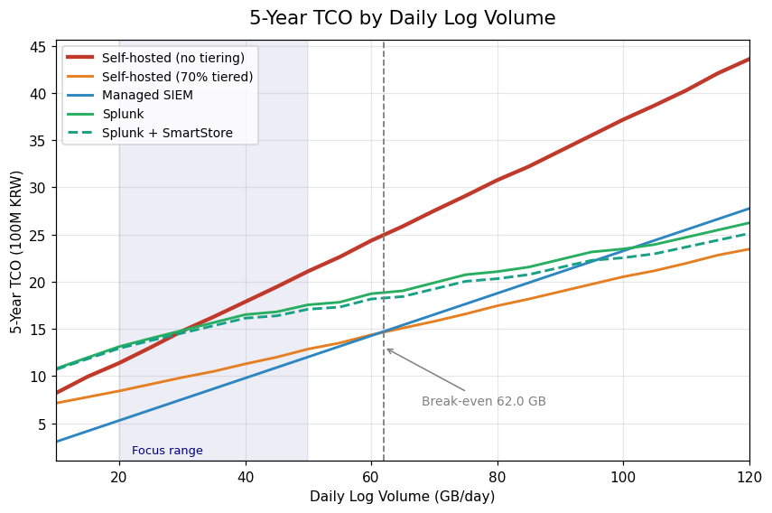
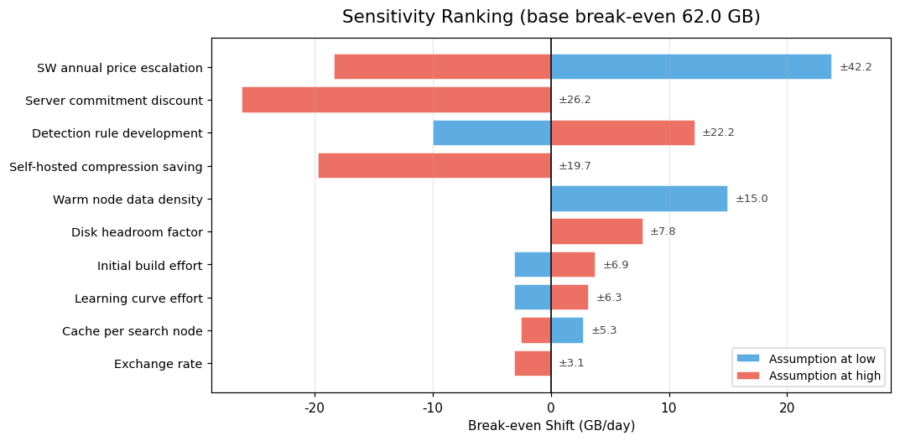
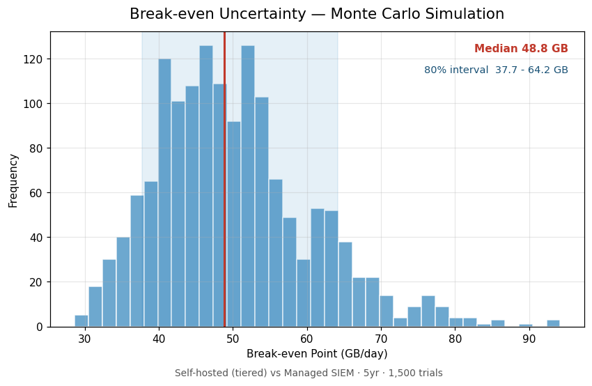
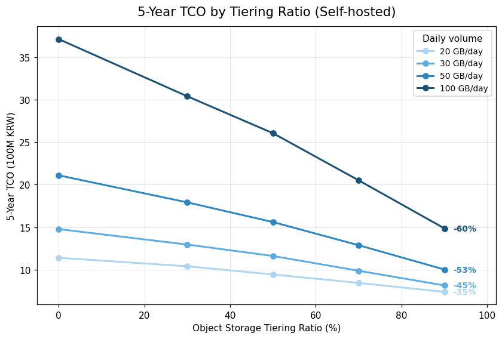
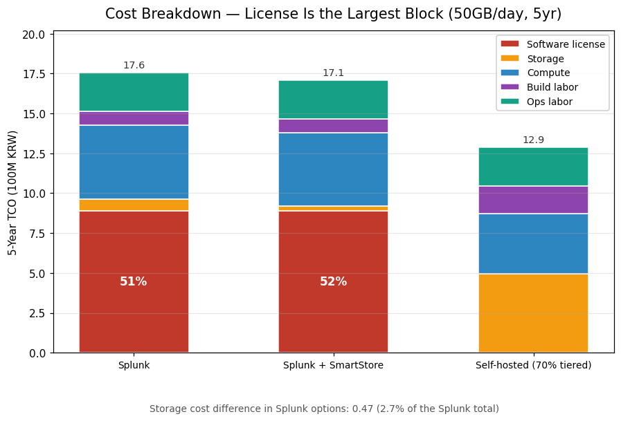

# SIEM: Build vs. Buy — A Total Cost of Ownership Analysis

> **[한국어로 읽기 / Read in Korean →](README.ko.md)**

---

## What This Project Is

Organizations that handle customer data are required to collect and retain security logs. To make sense of those logs, they need a system called a **SIEM** (Security Information and Event Management) — software that gathers access records from servers and network devices in one place and flags suspicious activity.

There are two ways to get one. You can **build** it yourself using free open-source software, or you can **buy** a commercial product. The open-source route looks obviously cheaper, since the software costs nothing.

This project asks whether that is actually true.

> **"We could just build it with open source. So why should we pay for a product?"**

The answer is not a single yes or no. It depends on how much log data an organization produces each day. This project builds a calculator that finds the point where the two options cost the same, and shows what that point depends on.

**The output is not a conclusion. It is a tool.** If the analysis had found that self-hosting always wins, that finding would have been reported as-is. Hiding an inconvenient result would defeat the purpose of the exercise.

---

## The Short Answer

| Condition (5-year contract) | Recommendation |
|---|---|
| Below ~37 GB/day | **Buy.** Labor costs exceed the license savings |
| 37–56 GB/day | **Depends.** The answer shifts based on in-house capability |
| Above ~56 GB/day | **Build may win** — but only under one condition |

**That condition turned out to be the most important finding in the project.** Self-hosting is only competitive if the storage is *tiered* — that is, if older data is moved to cheaper storage instead of sitting on expensive high-performance disks. Without tiering, self-hosting lost to every commercial option across the entire range examined (5–200 GB/day). It never won once.

There is also a second condition that is easy to miss: **contract length**. On a 3-year contract the break-even point moves to about 123 GB/day — far outside the range most mid-sized organizations operate in.

---

## How the Analysis Was Built

The project was built in stages. Each stage exists because the previous one raised a question it could not answer. This section follows that chain.

### Stage 0 — Deciding what to compare

Before calculating anything, the scope had to be fixed: which options to compare, what to measure them against, and over what period.

Two decisions here mattered later.

**The measuring stick is daily log volume (GB/day).** Not company size, not employee count. Log volume drives both storage cost and processing cost, so it is the variable that actually moves the answer.

**Both 3-year and 5-year periods are calculated.** Self-hosting front-loads its cost — most of the build effort happens in year one. If only one period were used, the conclusion would be decided by that choice rather than by the analysis. This precaution turned out to be necessary: the two periods produce break-even points that differ by a factor of 2.8.

→ *Scope now fixed. But "how much does it cost" depends on who is asking. That led to the next stage.*

### Stage 1 — Understanding the organization

The analysis targets a mid-sized e-commerce company in South Korea. Three facts about such an organization shape the entire calculation.

**Logs must be retained for two years.** Korean regulation requires organizations processing personal data for 50,000 or more individuals to retain access records for at least two years. **This single fact makes most published SIEM cost analyses unusable here**, because they typically assume 90 days to one year of retention. Doubling retention doubles storage.

**Security staffing varies enormously.** Public disclosure filings from six comparable companies showed security staff ranging from 1.5% to 7.1% of IT headcount. The largest company had the highest ratio and a mid-sized one the lowest — meaning this ratio reflects *investment posture*, not company size. Averaging these numbers would produce a figure that matches no real company, so a range is used instead.

**One thing could not be determined: how much log data such a company actually produces.** Estimating it would have required chaining five assumptions together (visitors → page views → API calls → log events → volume), and errors in a chain like that multiply rather than add. Five steps with a 2x error each produces a 32x error at the end.

So log volume was **left as an input variable** rather than estimated. This decision shaped the entire project: the deliverable became a calculator rather than a report with a single number.

→ *We now know who we are calculating for. Next: what counts as a cost?*

### Stage 2 — Defining what counts as cost

Costs were grouped into four buckets. The grouping is not arbitrary — it mirrors the structure of the question.

| Bucket | Favors | Timing |
|---|---|---|
| Software licenses | Self-hosting (open source is free) | Recurring |
| Data retention | Depends on scale | Recurring |
| Build labor | Buying (vendor does the work) | One-time |
| Operating labor | Buying | Recurring |

**Two buckets favor buying, one favors building, and one flips depending on scale.** The break-even point is where the sum reverses. Keeping the buckets separate — rather than reporting one total — makes it possible later to ask questions like "what if we exclude labor?"

Three items in the retention and operating buckets exist **only because of Korean regulation**: two-year storage, backup redundancy, and ISMS certification support. These are the columns absent from overseas analyses.

**Two items were deliberately excluded.** Opportunity cost overlaps with operating labor and would be double-counted. Breach risk cost cannot be estimated without knowing breach probability, so it was deferred to a later stage rather than invented.

→ *We know what to count. Now we need actual prices.*

### Stage 3 — Collecting prices, and hitting a wall

Cloud storage and compute prices were straightforward: they are published. Seoul-region rates were collected directly from the vendor's price list.

**The wall was managed SIEM pricing in Korea.** No vendor publishes it.

Public-sector procurement records seemed like the best available proxy, so five bid documents from government agencies were examined in full. **None of them contained any data-volume figures.** Investigating why produced two findings, both useful.

**First, the information is withheld by regulation.** The documents do contain sections titled "system status" and "IT infrastructure overview" — but the contents are replaced with a note stating they are withheld under Article 17 of the government's information systems guideline, viewable only on-site after signing a confidentiality agreement. This means the absence of Korean pricing is not a research failure but a structural condition. It also means the fallback method — working backwards from published overseas prices — rests on a documented reason rather than convenience.

**Second, Korean contracts are not priced by data volume at all.** They are priced by headcount.

| Agency | Contract basis | Annual value | Per person |
|---|---|---|---|
| Supreme Prosecutors' Office | 13 staff on site | ₩1.21B | ~₩93M |
| Bank of Korea | 26 staff minimum | ₩3.77B | ~₩145M |

This range (₩93M–145M per person) **almost exactly matches** the labor cost figure derived independently from national wage statistics (₩93.0M–121.8M). A number obtained from statistics was confirmed by actual contracts — an unplanned cross-validation.

→ *Prices collected. But converting "50 GB of logs" into "how much disk do I need" turned out to be a problem of its own.*

### Stage 3b — From log volume to actual disk space

A customer saying "we generate 50 GB per day" does not mean 50 GB of disk. Three transformations happen in between.

**Compression and indexing.** Raw logs compress to about 15% of original size, but a search index adds roughly 35% back. Together, about 50%.

**Replication.** Copies are kept for resilience. This is where a correction was needed. The original model multiplied everything by a single replication factor, but **raw data and search indexes replicate under separate factors** in real deployments. Where the two differ — a common configuration — treating them as one overstates storage. The formula was split accordingly.

**Archival.** Older data drops its search index and shrinks to about 15% — but becomes non-searchable.

These coefficients were verified against vendor documentation. A worked example: 100 GB/day retained one year produces roughly 1.5 TB hot, 3 TB cold, and 4 TB archived.

**A second correction was needed here.** Elasticsearch-based systems work the opposite way: instead of compressing below the original size, they add about 15% overhead on top. Splunk shrinks data; Elastic grows it. Mixing up the two coefficient systems would silently corrupt every downstream number, so the calculation paths were separated into different functions, with a test that fails if the two ever produce identical results.

→ *Now we can convert volume to capacity, and we have unit prices. Time to multiply.*

### Stage 4 — Building the calculation engine

Up to this point, one module knew *how much storage is needed* and a separate data file knew *what storage costs*. Neither produced money. This stage joined them.

A deliberate safeguard was built into the price loader: **if a price is missing, the calculation stops with an error rather than treating it as zero.** A missing value silently becoming zero would produce a plausible-looking but wrong result — for instance, "self-hosted server cost: ₩0."

**This stage also caught the most consequential error in the project.** Managed SIEM is priced per gigabyte ingested. The first implementation multiplied that rate by 12 (treating it as monthly) when it should have been 365 (it is charged daily, on every gigabyte ingested). The result was off by roughly 30x — enough to make managed SIEM appear dramatically cheaper than everything else and invert the entire conclusion. The error was caught when the output looked implausibly low and was traced back.

→ *We can now calculate cost for any given volume. The original question runs the other way: at what volume do costs meet?*

### Stage 5 — Finding the break-even point

This stage reverses the direction: instead of "volume in, cost out," it asks "at what volume are two options equal?"

The obvious method is binary search. Before writing it, the cost-difference curve was sampled at 1 GB intervals — and it turned out **not to be smooth**. Server counts jump in whole numbers (you cannot buy 2.3 servers), and a minimum of three nodes applies for high availability. The curve has local bumps where the difference briefly reverses direction. Binary search alone can land on the wrong point in such a curve.

The method used instead scans the full range first to locate every sign change, then refines within each. Slower, but it does not miss crossings.



*Each line is one option. The thick red line is self-hosting without tiering — note that it never drops below any other line at any point. The shaded band is the focus range for mid-sized organizations.*

**Of the six comparisons calculated, three produced no crossing at all.** Self-hosting without storage tiering lost across the entire range. That result was reported as-is rather than adjusted.

One note on scope: five options produce ten possible pairs, but only six were calculated. Comparisons within the same camp — self-hosted versus self-hosted-with-tiering, for instance — answer a configuration question, not a build-versus-buy question. This selection is stated explicitly in the proposals so that the omission is visible rather than silent.

→ *We have a number: 44.2 GB. But it rests on assumptions, some of which have no source. How much can it be trusted?*

### Stage 6 — Testing how much the answer can be trusted

Several inputs — particularly the labor estimates — had no verifiable source. Presenting a break-even point built on them as a fixed figure would be misleading.

Two analyses were run.

**One variable at a time**, to rank which assumptions matter most:



*The longest bar moves the answer roughly ten times as much as the shortest. Blue means the assumption was set to its low end, red to its high end — not "optimistic" and "pessimistic," since the direction reverses depending on the item.*

**This ranking exposed a problem.** The single most influential input — annual software price escalation — had no source at all. An input that moves the answer by 29.7 GB was resting on a guess.

Research into SaaS renewal benchmarks found five independent sources converging on 8–12% annual increases. The value in use was 3–10%, with a midpoint of 6.5% — **below the market floor**. This meant software costs were being understated, which biased the analysis *in favor of commercial products*. The value was raised to 6–15%.

The correction moved the break-even point from 60.2 GB to 44.2 GB — into the range where mid-sized organizations actually operate, making the analysis more relevant rather than less.

**All variables at once**, to find the real uncertainty:



*1,500 simulations. The distribution has width, which is the point: the answer is a range, not a value.*

The correct statement is therefore not "the break-even point is 44.2 GB" but **"approximately 46 GB, falling between 37 and 56 GB with 80% confidence."**

*(A note on method: this is not forecasting. No model is trained and no future is predicted. Values are drawn at random from ranges that were already established with evidence. The project deliberately avoids statistical prediction — stated as a principle at the outset — and this respects that boundary.)*

→ *We now know how much the numbers can be trusted. But some things never became numbers at all.*

### Stage 7 — What could not be turned into numbers

Six factors were identified that resist quantification. Documenting them matters because **an item absent from a cost table looks like it costs nothing**, when in fact it may simply be unmeasurable.

**Detection content.** Installing a SIEM does not detect attacks; someone must write the rules that define what counts as suspicious. Commercial products ship with vendor rules. But industry practice indicates vendor content still requires **20–40 hours of tuning per use case**, with a typical split of 60% vendor content (heavily modified) and 40% built in-house. The difference between building and buying is the starting point, not the total.

**Breach risk.** Average breach cost is knowable — roughly $2.84M in Korea. Breach *probability* is not, and neither is how that probability differs between options. Multiplying an invented probability by a real cost would let one made-up coefficient decide the entire conclusion.

The remaining four — cache-miss latency, archive retrieval delay during audits, market entry barriers, and headcount-based contracting — are documented in the same way.

**These factors do not all point the same direction**, which is itself worth stating:

| Unmeasured factor | Biases result toward |
|---|---|
| Vendor rule tuning treated as zero | **Against** self-hosting |
| Detection work treated as one-time | **For** self-hosting |
| Market entry barriers ignored | **For** managed SIEM |

Because they offset, no net bias can be claimed. That admission is more useful than a confident claim would be.

→ *Numbers, uncertainty, and limitations are all documented. The final step is saying it in a way a customer can act on.*

### Stage 8 — Writing it for a customer

The analysis was written up as two proposals, in the format used to respond to a request for proposal. They share the same engine and data, and differ only in what they conclude.

---

## The Two Proposals

### 📄 [Proposal A — SIEM Adoption Method Review](docs/phase08a_presales_cisco.md)

*Build or buy, and under what conditions.*

Written for a security team evaluating whether to construct a SIEM in-house. Covers the break-even range, what shifts it, and the conditions under which self-hosting becomes viable.

**Its central finding is a constraint, not a recommendation:** self-hosting without storage tiering lost across the entire range examined. The proposal states this plainly rather than presenting a balanced-sounding conclusion.

### 📄 [Proposal B — Log Storage Tier Design Review](docs/phase08b_presales_dell.md)

*How storage architecture drives SIEM cost.*

Written for an infrastructure team. Argues that storage design, not software selection, is where SIEM costs are decided.



*Moving 70% of data to object storage cuts five-year cost by 31% at 50 GB/day. The effect grows with scale.*

**This proposal required rewriting mid-analysis.** The original argument was that connecting object storage to a commercial SIEM reduces total cost. The calculation showed otherwise:



*In the commercial options, the license block dominates and the storage block is barely visible. In self-hosting, storage is a major component.*

License costs are **87% of the total** for commercial products, so a storage saving of ₩0.1M disappears into a ₩1,438M total — a difference of 0.07%.

Rather than present the total and let the customer discover this later, the proposal states it directly and relocates the argument to where the evidence actually supports it: **storage design matters enormously for self-hosted deployments, and shows up as reduced local hardware requirements (down 87%) for commercial ones.**

---

## Errors Found and Corrected

Five errors were found and fixed during the work. They are listed because **the process of finding them is part of what the project demonstrates** — a calculation that has never been challenged is not a verified calculation.

| # | Error | Impact if left | How it surfaced |
|---|---|---|---|
| 1 | Managed SIEM billed monthly instead of daily | ~30x understatement — would have inverted the conclusion | Output looked implausibly low |
| 2 | Replication applied as a single factor | Overstated self-hosted storage | Reading vendor documentation closely |
| 3 | SmartStore modeled identically to standard Splunk | The storage argument had no numerical basis | Two options produced identical results |
| 4 | Archive lifecycle omitted from remote tier | 2.5x storage overstatement | Result contradicted expectation |
| 5 | Chart summed one year × five instead of accumulating | ~₩300M understated; chart segments did not sum to the total | Bar height did not match its label |

Error 5 is now prevented by an assertion that halts execution if a chart's components fail to sum to its total. A chart whose parts do not add up is a chart that misinforms.

**One design flaw was also caught.** The sensitivity analysis automatically selects which inputs to test based on their verification status. When the price escalation rate was upgraded after finding sources, it silently dropped off that list — because the code could not distinguish "now has evidence" from "no longer influential." The most important variable would have quietly vanished from the analysis. It is now explicitly retained, with a test to prevent recurrence.

---

## Running It

```bash
pip install -r requirements.txt

python -m pytest tests/ -v     # 126 tests
python src/breakeven.py        # break-even points
python src/sensitivity.py      # sensitivity analysis
python src/make_charts.py      # regenerate all charts
```

All prices and coefficients live in `data/pricing.yaml` with their source URL, retrieval date, and a confidence grade. Changing a value there propagates through every calculation and chart. Random seeds are fixed, so results reproduce exactly.

Each entry carries a status: `confirmed` (verified against a primary source), `partial`, `assumed` (a range with no evidence), or `pending`. Entries marked `assumed` are automatically included in the sensitivity analysis, so an unsupported number cannot quietly influence the conclusion without being tested.

---

## Repository Structure

```
├── docs/                      Stage-by-stage documentation
│   ├── phase00_scope.md         Scope and comparison targets
│   ├── phase01_...              Organization profile and regulation
│   ├── phase02_...              Cost structure
│   ├── phase03_...              Price collection
│   ├── phase03b_...             Storage layer
│   ├── phase04_...              Calculation engine
│   ├── phase05_...              Break-even analysis
│   ├── phase06_...              Sensitivity analysis
│   ├── phase07_...              Non-quantifiable factors
│   ├── phase08a_...             Proposal A
│   └── phase08b_...             Proposal B
├── data/pricing.yaml          Price ledger with sources
├── src/                       Calculation modules
├── tests/                     126 tests
└── outputs/figures/           12 charts (Korean and English)
```

Each stage document records three things: what was decided, what was considered and rejected, and why. The rejected options are kept deliberately — the reasoning behind a discarded approach is often more informative than the one that was adopted.

---

## Sources

All figures used in the analysis were verified against a primary or documented source. Values that could not be verified are marked as assumptions and included in the sensitivity analysis.

### Regulation and official statistics

1. **Standards for Securing Personal Data Safety, Article 8** (effective 2025-10-31) — two-year retention requirement for access records
   https://www.law.go.kr/admRulLsInfoP.do?chrClsCd=010202&admRulSeq=2100000229672
2. **KISA Information Security Disclosure Portal** — security staffing ratios for comparable companies
   https://isds.kisa.or.kr/kr/publish/list.do?menuNo=204942
3. **Korea Software Industry Association**, 2025 Software Engineer Average Wage — fully-loaded labor cost
   https://www.sw.or.kr/site/sw/ex/board/View.do?cbIdx=304&bcIdx=57938
4. **KONEPS (Korea ON-line E-Procurement System)** — public sector security operations contracts
   https://www.g2b.go.kr/

### Vendor documentation

5. **Splunk** — storage sizing (raw data 15%, index 35%)
   https://help.splunk.com/en/splunk-enterprise/get-started/deployment-capacity-manual/10.4/hardware-capacity-planning/estimate-your-storage-requirements
6. **Splunk** — archive behavior (index removed at frozen stage)
   https://help.splunk.com/en/splunk-enterprise/administer/manage-indexers-and-indexer-clusters/9.0/indexing-overview/back-up-and-archive-your-indexes/archive-indexed-data
7. **Splunk** — SmartStore architecture (remote store as system of record)
   https://help.splunk.com/en/splunk-enterprise/administer/manage-indexers-and-indexer-clusters/9.1/implement-smartstore-to-reduce-local-storage-requirements/smartstore-architecture-overview
8. **Splunk** — SmartStore cache manager
   https://help.splunk.com/en/data-management/manage-splunk-enterprise-indexers/9.4/how-smartstore-works/the-smartstore-cache-manager
9. **Dell Technologies** — ECS with Splunk SmartStore configuration guide (H17780)
   https://www.delltechnologies.com/asset/en-id/products/storage/technical-support/h17780_dell_emc_ecs_with_splunk_smartstore_configuration_guide.pdf
10. **Dell Technologies** — SmartStore validated design
    https://infohub.delltechnologies.com/en-us/l/design-guide-cloud-native-splunk-enterprise-with-smartstore-predictive-maintenance-for-it-operations/solution-concepts-3/
11. **Elastic** — node and shard sizing guidance
    https://www.elastic.co/search-labs/blog/elasticsearch-node-shard-size-best-practices
12. **Elastic** — general sizing (1.15 overhead factor)
    https://www.elastic.co/docs/deploy-manage/production-guidance/general-sizing
13. **AWS** — S3 pricing, Seoul region
    https://aws.amazon.com/s3/pricing/
14. **AWS** — regional pricing, ap-northeast-2 (block storage and compute)
    https://aws-pricing.com/ap-northeast-2.html
15. **AWS OpenSearch** — sharding best practices
    https://docs.aws.amazon.com/opensearch-service/latest/developerguide/bp-sharding.html
16. **Cisco Systems** — Form 10-K FY2025 (SEC filing), security segment revenue
    https://www.sec.gov/edgar/browse/?CIK=858877

### Market research (third party)

Vendors do not publish list prices for SIEM software, so third-party estimates were used where necessary. These are graded at lower confidence and included in the sensitivity analysis.

17. **Resubly**, SaaS Inflation Index 2026 — 8–12% renewal increase guidance
    https://resubly.com/blog/saas-inflation-12-percent-2026/
18. **Zylo**, 2026 SaaS Management Index — 79% of IT leaders saw renewal increases
    https://zylo.com/blog/saas-pricing-trends
19. **Renewly** — average ~12% annual increase, aggressive renewals 15–30%
    https://renewly.gg/blog/software-renewal-price-increases-2026
20. **Appventory** — average renewal uplift 8.7%
    https://www.appventory.com/blog/how-to-stay-ahead-of-rising-business-software-renewal-costs
21. **BayTech Consulting** — 12.2% annual software price increase
    https://www.baytechconsulting.com/blog/saas-pricing-shift-negotiate-ai-driven-renewals
22. **SIEMCostCalculator** — Splunk per-GB ingest pricing
    https://siemcostcalculator.com/splunk-pricing
23. **SIEMCostCalculator** — Microsoft Sentinel pricing
    https://siemcostcalculator.com/sentinel-pricing
24. **SIEMCostCalculator** — EPS-to-GB conversion warning (30–50% distortion)
    https://siemcostcalculator.com/eps-to-gb-conversion
25. **IBM** — Cost of a Data Breach Report 2026
    https://newsroom.ibm.com/2026-07-29-ibm-study-one-in-four-malicious-breaches-are-ai-enabled,-costing-companies-6-million-on-average
26. **StationX** — breach statistics by region (Korea average $2.84M)
    https://app.stationx.net/articles/cyber-security-breach-statistics
27. **Networkers Home** — SIEM use case development (20–40 hours tuning per use case)
    https://www.networkershome.com/fundamentals/siem-soc/siem-use-case-development-library/
28. **Detection Engineering Maturity Model 2026** — five-level maturity framework
    https://www.decryptiondigest.com/blog/detection-engineering-maturity-model
29. **IDC Global DataSphere Forecast** — data growth CAGR 23–26%
    https://www.marketresearch.com/IDC-v2477/Worldwide-IDC-Global-DataSphere-Forecast-31469143/

### A note on source reliability

Sources are not treated as equally reliable. Regulation and government statistics (1–4) carry the highest weight. Vendor documentation (5–16) is reliable for technical specifications, but any performance or cost claims within it were excluded — a vendor describing how its own product behaves is credible; a vendor describing why its product is better is not evidence.

Third-party market research (17–29) was used only where vendors withhold pricing. Where several independent sources converge on a similar figure, that convergence is noted; where a single source stands alone, the value is graded as an assumption and tested in the sensitivity analysis.
