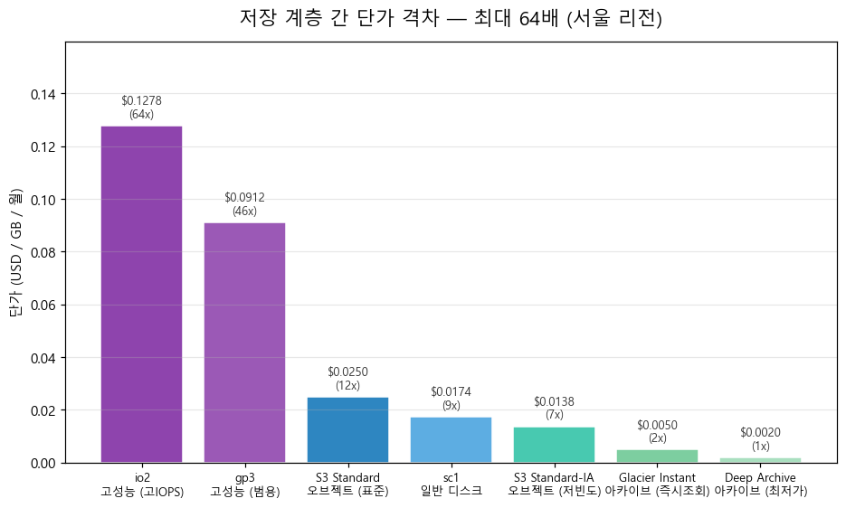

# 보안 로그 저장 계층 설계 제안서

**— SIEM 총소유비용에서 스토리지 설계가 차지하는 비중 분석 —**

| 항목 | 내용 |
|---|---|
| 문서 성격 | 인프라 설계 검토 및 비용 분석 제안서 |
| 대상 고객 | 전자상거래 중견기업 (인프라 담당 부서) |
| 검토 대상 | 보안 로그 저장 계층 구조 (로컬 / 오브젝트 계층화) |
| 작성일 | 2026년 9월 3일 |
| 문서 번호 | phase08b |

> **2026-09-16 개정 — 원 프로젝트 검증 반영.** 계산 구조의 오류(연도별 보관량, 오브젝트 계층 사본 수, 복제 계수 기본값, 서버 대수·사양, Splunk 가격 구조 등)를 바로잡고 전 수치를 다시 산출했습니다. 핵심 논지(저장 계층 설계가 자체 구축의 승부처, 상용 제품에서는 총액 효과가 작음)는 유지되지만 수치가 바뀌었습니다 — 계층화 70% 절감 31 → **39%**, Splunk 라이선스 비중 87 → **51%**, 오브젝트 연동의 총액 효과 0.07 → **2.7%**. 종전 값과 원인은 [`ERRATA.md`](ERRATA.md) E-02에 있습니다.

---

## 1. 요약 (Executive Summary)

본 제안서는 **"보안 로그 분석 시스템(SIEM)의 저장 계층을 어떻게 설계하느냐가 총소유비용에 얼마나 영향을 미치는가"**를 분석한 결과입니다.

**핵심 결론은 다음과 같습니다.**

> **SIEM 도입 비용의 승부처는 소프트웨어 선택이 아니라 저장 계층 설계에 있습니다.**

근거를 세 가지로 말씀드립니다.

**첫째, 계층화 여부가 5년간 39%의 비용 차이를 만듭니다.** 동일한 오픈소스 SIEM을 도입하시더라도, 모든 데이터를 고성능 디스크에 두는 경우와 오래된 데이터를 오브젝트 스토리지로 내리는 경우의 5년 총비용이 **하루 50GB 기준 21억 1천만원 대 12억 9천만원**으로 갈립니다.

**둘째, 계층화하지 않은 자체 구축은 관리형 SIEM 대비 어떤 규모에서도 경쟁력이 없습니다.** 분석한 전 구간(하루 5~200GB)에서 비용이 높았고, Splunk(목록가)와 비교해도 하루 약 32GB를 넘으면 비쌌습니다. 즉 오픈소스의 라이선스 절감 효과가 로그량이 늘수록 저장 비용에 잠식됩니다.

**셋째, 저장 계층 간 단가 격차가 최대 64배에 달합니다.** 최고 성능 계층과 최저가 아카이브 계층의 GB당 월 단가가 그만큼 차이 나므로, 어느 데이터를 어느 계층에 두느냐가 비용을 좌우합니다.

**다만 한 가지를 미리 밝혀 둡니다.** 상용 제품(Splunk 계열)의 경우 라이선스가 총비용의 약 51%로 가장 큰 항목이어서, 저장 계층 최적화 효과가 총액에서는 약 2.7%로 작게 나타납니다. 이 사실을 감추지 않고 5장에서 상세히 다루었습니다.

---

## 2. 고객 요구사항 이해

### 2.1 저장 요건

| 항목 | 값 | 근거 |
|---|---|---|
| 접속기록 보관 의무 | **2년(730일)** | 개인정보의 안전성 확보조치 기준 제8조 |
| 데이터 증가율 | 연 20~30% | 업계 데이터 증가 추세 |
| 대상 리전 | 서울 | 개인정보 국내 보관 요건 고려 |

**보관 의무 2년이 설계의 출발점입니다.** 해외 SIEM 설계 자료는 통상 90일에서 1년 보관을 전제하므로 국내 환경에 그대로 적용할 수 없습니다. 보관 기간이 길어질수록 **오래된 데이터의 비중이 커지며, 이것이 계층화의 경제성을 만드는 근본 원인**입니다.

### 2.2 로그량이 실제 디스크 용량이 되기까지

고객께서 "하루 50GB의 로그가 발생한다"고 하실 때, 실제 필요한 디스크는 그 값이 아닙니다. **세 단계의 변환**을 거칩니다.

**1단계 — 압축과 색인.** 원본 로그는 압축되어 약 15% 크기가 되지만, 빠른 검색을 위한 색인이 별도로 약 35% 추가됩니다. 합하면 원본의 약 50%입니다.

**2단계 — 복제.** 장애에 대비해 사본을 둡니다. 여기서 주의하실 점이 있습니다. **원본과 색인은 서로 다른 계수로 복제됩니다.** 원본은 복제 계수(RF), 색인은 검색 계수(SF)를 따르며, 두 값을 다르게 설정하는 구성이 실무에서 흔합니다(제조사 기본값 RF 3, SF 2). 이를 하나로 뭉쳐 계산하면 저장량을 잘못 산정하게 됩니다.

**3단계 — 아카이브 전환.** 오래된 데이터는 색인을 제거하고 원본만 남기므로 약 15%로 줄어듭니다. 대신 그 구간은 즉시 검색이 불가능해집니다.

**참고: 하루 100GB, 1년 보관 시 (사본 1벌 기준)**

| 계층 | 보존 | 계산 | 용량 |
|---|---|---|---|
| Hot/Warm | 30일 | 100 × 0.5 × 30 | 1.5 TB |
| Cold | 60일 | 100 × 0.5 × 60 | 3.0 TB |
| Frozen (아카이브) | 270일 | 100 × 0.15 × 270 | 약 4.0 TB |

**본 요건인 2년 보관에서는 아카이브 구간이 크게 늘어나며, 여기서 계층화의 경제성이 발생합니다.**

---

## 3. 요구사항 대응 현황 (Compliance Matrix)

| # | 요구사항 | 로컬 단일 계층 | 로컬 + 오브젝트 계층화 |
|---|---|---|---|
| 1 | 접속기록 2년 보관 | ○ (비용 부담 큼) | **○ (비용 최적)** |
| 2 | 최근 데이터 고속 검색 | ○ | ○ (로컬 캐시 유지) |
| 3 | 과거 데이터 조회 | ○ | △ (인출 지연 발생) |
| 4 | 용량 증설 대응 | △ (물리 증설 필요) | **○ (오브젝트는 탄력적)** |
| 5 | 고가용성 | △ (복제본만큼 용량 배증) | **○ (원격이 원본 역할)** |
| 6 | ISMS 심사 자료 제출 | ○ | △ (아카이브 계층 선택에 따라 지연) |

**5번 항목에 대해 부연드립니다.** 일반적인 구성에서는 고가용성을 위해 각 노드가 데이터 사본을 보유해야 하므로 복제본 수만큼 용량이 늘어납니다. 반면 오브젝트 스토리지를 원격 저장소로 사용하는 구성에서는 **원격 저장소가 원본 역할(System of Record)을 하므로 각 노드가 사본을 유지할 필요가 없습니다.**

이는 제조사 공식 문서에 명시된 동작입니다. 데이터가 원격으로 전송되면 대상 노드들은 자신의 사본을 삭제하며, **"원격 저장소가 여러 로컬 사본 유지 없이도 고가용성을 보장하기 때문"**이라고 설명되어 있습니다.

**3번과 6번은 계층화의 대가입니다.** 이를 감추지 않고 5장과 6장에서 다루겠습니다.

---

## 4. 비용 분석

### 4.1 계층 간 단가 격차 — 설계의 근거

서울 리전 기준 실측 단가입니다. (USD / GB / 월)

| 계층 | 서비스 | 단가 | 최저 대비 |
|---|---|---|---|
| 고성능 (고IOPS) | 블록 스토리지 io2 | 0.1278 | **64배** |
| 고성능 (범용) | 블록 스토리지 gp3 | 0.0912 | 46배 |
| 일반 | 블록 스토리지 sc1 | 0.0174 | 9배 |
| 오브젝트 (표준) | S3 Standard | 0.025 | 13배 |
| 오브젝트 (저빈도) | S3 Standard-IA | 0.0138 | 7배 |
| 아카이브 (즉시조회) | Glacier Instant | 0.005 | 2.5배 |
| 아카이브 (최저가) | Glacier Deep Archive | **0.002** | 1배 |

**최고 계층과 최저 계층의 격차가 64배입니다.** 전체 데이터를 고성능 계층에 두는 설계와 계층별로 나누는 설계의 차이가 여기서 발생합니다.

**〈그림 1〉 저장 계층 간 단가 격차 (서울 리전)**

표의 "배수" 열만으로는 격차의 크기가 잘 와닿지 않습니다. 막대를 나란히 놓고 보시면 **최저가 아카이브 계층이 눈에 거의 보이지 않을 정도로 낮다**는 점이 드러납니다. 계층 설계가 왜 비용을 좌우하는지에 대한 근거입니다.

### 4.2 계층화 비율에 따른 총비용 변화

오래된 데이터 중 몇 퍼센트를 오브젝트 계층으로 내리는지에 따른 5년 총소유비용입니다. (단위: 백만원)

| 일일 로그량 | 계층화 0% | 30% | 50% | 70% | 90% |
|---|---|---|---|---|---|
| 20 GB | 1,138 | 1,038 | 941 | 842 | **737** |
| 30 GB | 1,477 | 1,294 | 1,160 | 985 | **812** |
| 50 GB | 2,110 | 1,792 | 1,560 | 1,286 | **1,000** |
| 100 GB | 3,716 | 3,043 | 2,607 | 2,052 | **1,486** |

**하루 50GB 기준으로 계층화 비율을 0%에서 70%로 높이면 5년간 8억 2,400만원(39%)이 절감됩니다.** 90%까지 높이면 11억 1,000만원(53%)입니다.

**절감 효과는 로그량이 클수록 커집니다.** 하루 100GB에서는 계층화(70%)만으로 16억 6,500만원(45%)이 절감됩니다.

**〈그림 2〉 계층화 비율에 따른 5년 총소유비용 변화**

네 개의 선이 모두 우하향한다는 것은 **어떤 규모에서든 계층화가 비용을 낮춘다**는 뜻입니다. 선의 기울기가 위쪽(로그량이 큰 경우)일수록 가파른 것은, **규모가 클수록 계층화의 중요성이 커진다**는 의미입니다. 각 선 끝의 백분율은 계층화를 적용하지 않은 경우 대비 절감률입니다.

### 4.3 계층화가 도입 성패를 가르는 이유

계층화 여부에 따라 **자체 구축의 경쟁력 자체가 달라집니다.**

| 비교 | 5년 손익분기점 |
|---|---|
| 자체 구축 **(계층화 미적용)** vs 관리형 SIEM | **교차점 없음 — 전 구간 열세** |
| 자체 구축 **(계층화 미적용)** vs Splunk (목록가) | 32.0 GB/day — 이상에서 열세 |
| 자체 구축 **(계층화 70%)** vs 관리형 SIEM | 62.0 GB/day — 이상에서 우세 |
| 자체 구축 **(계층화 70%)** vs Splunk (목록가) | **교차점 없음 — 전 구간 우세** |

**첫 두 행이 핵심입니다.** 계층화하지 않은 자체 구축은 분석한 전 구간(5~200GB)에서 관리형 SIEM보다 비용이 높았고, Splunk 대비로도 하루 32GB를 넘으면 열세였습니다. 오픈소스의 라이선스 절감 효과가 로그량이 늘수록 저장 비용에 잠식된 것입니다. 같은 자체 구축에 계층화만 적용하면 Splunk 목록가 대비 전 구간 우세로 바뀝니다.

**즉 스토리지 설계는 비용 최적화 수단이 아니라, 자체 구축이라는 선택지가 성립하기 위한 전제 조건입니다.**

### 4.4 상용 제품의 계층화 — 로컬 부담 감소

상용 제품에도 원격 오브젝트 스토리지를 연동하는 구성이 있습니다. 하루 50GB로 2년치가 찬 상태의 저장 구조를 비교하면 다음과 같습니다(복제 계수 RF 3·SF 2 적용).

| 구분 | 로컬 고성능 | 로컬 일반 | 원격 오브젝트 | **로컬 합계** |
|---|---|---|---|---|
| 일반 구성 | 1.7 TB | 3.5 TB | 14.4 TB (아카이브 3벌) | **5.2 TB** |
| 오브젝트 연동 구성 | 0.35 TB | 0 | 7.1 TB (1벌) | **0.35 TB** |

**로컬 스토리지 부담이 5.2TB에서 0.35TB로 약 93% 감소합니다.** 원격 오브젝트 용량도 줄어드는데, 일반 구성은 아카이브를 복제 계수만큼(3벌) 보관하는 반면 오브젝트 연동 구성은 원격 저장소가 원본 역할을 해 1벌만 두기 때문입니다. 그 결과 5년 저장 비용은 75백만원에서 28백만원으로 약 63% 줄어듭니다.

**다만 총비용 관점에서는 효과가 제한적입니다.** 이 점을 5장에서 정직하게 다루겠습니다.

---

## 5. 가정 및 제외 사항

### 5.1 상용 제품에서는 스토리지 최적화 효과가 총액에 크게 드러나지 않습니다

**본 분석에서 가장 중요하게 말씀드려야 할 한계입니다.**

하루 50GB, 5년 기준 상용 제품의 비용 구조를 분해하면 다음과 같습니다. (단위: 백만원)

| 항목 | 일반 구성 | 오브젝트 연동 구성 |
|---|---|---|
| 소프트웨어 라이선스 (공개 목록가) | 890 (**51%**) | 890 (52%) |
| 저장 비용 | 75 | 28 |
| 컴퓨트 비용 | 463 | 463 |
| 구축 인건비 (벤더 구축 서비스) | 86 | 86 |
| 운영 인건비 | 241 | 241 |
| **총계** | **1,755** | **1,708** |

**라이선스가 총액의 51%로 가장 크고 컴퓨트가 26%로 뒤따라, 저장 비용 차이(47백만원)가 총액에서는 2.7%에 그칩니다.** 저장 비용만 보면 63% 절감이지만 총액에서는 작게 보입니다.

> **2026-09-16 정정:** 종전 판은 라이선스 87%, 저장 비용 차이 0.1백만원(총액의 0.07%)으로 적었습니다. Splunk 라이선스를 구독형 요금 구조로 과대 계산하고, 보안 기능 최소 사양 서버·부가 서버·복제·구축 서비스·관리 인력을 빠뜨린 결과였습니다(E-02). "거의 보이지 않는다"에서 "작게 보인다"로 강도가 약해졌으나, 총액이 아니라 저장 항목을 분리해 보셔야 한다는 결론은 같습니다.

**〈그림 3〉 비용 구성 분해 — 상용 제품은 라이선스가 최대 항목입니다**

왼쪽 두 막대(상용 제품)에서 **붉은색 라이선스 칸이 절반을 차지하고, 주황색 저장 비용 칸은 얇습니다.** 반면 오른쪽 자체 구축 막대에서는 **주황색이 가장 큰 비중(약 39%)을 차지합니다.**

이 대비가 본 제안서의 핵심입니다. **저장 계층 설계의 가치는 자체 구축 환경에서 총액에 직접 반영되는 반면, 상용 제품 환경에서는 총액이 아니라 로컬 인프라 부담 경감으로 나타납니다.** 같은 기술을 도입하시더라도 어느 환경이냐에 따라 기대하실 효과가 다릅니다.

따라서 **"오브젝트 스토리지를 도입하면 총비용이 크게 줄어든다"는 주장은 상용 제품 환경에서는 성립하지 않습니다.** 이를 감추고 총액만 제시하면 고객께서 실제 도입 후 기대와 다른 결과를 마주하시게 됩니다.

**스토리지 최적화의 가치는 다른 곳에 있습니다.**

- **자체 구축 환경에서는 총액에 직접 반영됩니다** (4.2절, 최대 53% 절감)
- **상용 환경에서는 로컬 고성능 디스크 부담 감소**로 나타납니다 (약 93% 감소, 저장 비용 자체도 약 63% 감소)
- **용량 증설이 물리 작업 없이 가능**해집니다

### 5.2 본 분석은 클라우드 단가 기준입니다

본 제안서의 모든 저장 단가는 **퍼블릭 클라우드(서울 리전) 공개 가격**을 기준으로 산출하였습니다.

**온프레미스 환경에서는 비용 구조가 다릅니다.** 온프레미스 오브젝트 스토리지는 초기 도입비(CapEx)와 유지보수 계약이 발생하는 대신 월 사용료가 없으므로, 장기 보관에서는 유리해질 수 있습니다. 반대로 초기 투자 부담과 용량 증설의 물리적 제약이 있습니다.

**따라서 본 분석 결과를 온프레미스 구성에 그대로 적용하실 수는 없습니다.** 온프레미스 검토가 필요하신 경우 별도 산정이 필요하며, 이 경우 4.4절의 "로컬 디스크 약 93% 감소"가 실제 하드웨어 구매액 절감으로 직결되므로 효과가 더 클 것으로 예상됩니다.

### 5.3 캐시 미스로 인한 검색 지연

오브젝트 계층화 구성에서는 최근 데이터만 로컬에 캐시로 유지하고 나머지는 원격에 둡니다. **캐시에 없는 데이터를 검색하면 원격에서 가져와야 하므로 지연이 발생합니다.**

**지연 시간을 금액으로 환산하지 않았습니다.** 지연 빈도가 조직의 검색 패턴에 전적으로 의존하기 때문입니다. 최근 데이터만 조회하시는 경우 캐시 적중률이 높아 체감이 거의 없으나, 과거 데이터를 자주 조회하시는 경우 매번 인출이 발생합니다.

**설계 시 검토하실 사항:** 로컬 캐시 보존 기간을 짧게 설정할수록 저장 비용은 내려가지만 캐시 미스는 늘어납니다. 저장 비용과 검색 성능이 맞바꿔지는 구조이므로, 귀사의 실제 검색 패턴을 파악하신 뒤 결정하시기를 권합니다.

### 5.4 아카이브 계층 선택 시 인출 비용

최저가 아카이브 계층의 저장 단가는 표준 계층의 약 1/12이지만, **인출 시 저장 단가의 11배가 부과되고 최소 보관 기간 제약이 있습니다.**

| 계층 | 저장 (GB·월) | 인출 (GB) | 배수 | 최소 보관 |
|---|---|---|---|---|
| Glacier Deep Archive | $0.002 | $0.022 | **11배** | 180일 |
| Glacier Instant | $0.005 | $0.03 | 6배 | 90일 |
| Standard-IA | $0.0138 | $0.01 | 0.7배 | 30일 |

**ISMS 심사 시 접속기록 조회 요구가 발생하면 이 비용이 실현됩니다.** 인출 비용은 계산에 반영하였으나, 연간 조회 빈도에 대한 업계 표준이 없어 **조회 지연으로 인한 영향은 금액화하지 않았습니다.**

**따라서 저장 단가만 보고 최저가 계층을 선택하시는 것은 권하지 않습니다.** 조회가 잦은 환경에서는 총비용이 역전될 수 있습니다.

### 5.5 복제 계수 기본값

**본 분석은 제조사 공식 문서의 클러스터 기본값(원본 복제 계수 RF 3, 검색 계수 SF 2)을 적용**했습니다. 아카이브는 RF 벌수만큼, 오브젝트 연동 구성의 원격 저장소는 1벌로 계산했습니다. 오픈소스 쪽은 복제본 1벌(원본 포함 2벌)이며, 오브젝트 계층으로 내린 데이터는 1벌입니다. 귀사의 실제 구성이 이와 다르면 용량이 달라집니다.

> **2026-09-16 정정:** 종전 판은 기본값을 확정하지 못해 사본 1벌로 산출했습니다(E-02).

제조사 설계 문서에도 **복제 계수에 따라 저장 용량이 최대 3배까지 증가할 수 있다**고 명시되어 있습니다. 실제 구성 시 이 부분을 반드시 반영하셔야 합니다.

---

## 6. 리스크 및 완화 방안

| 리스크 | 내용 | 완화 방안 |
|---|---|---|
| 캐시 미스 지연 | 과거 데이터 조회 시 원격 인출 대기 | 캐시 보존 기간을 검색 패턴에 맞춰 설정 |
| 아카이브 인출 비용 | 저장 단가의 11배, 최소 보관 제약 | 조회 빈도를 사전 산정 후 계층 선택 |
| 복제로 인한 용량 증가 | 최대 3배까지 증가 가능 | RF/SF를 분리해 산정, 원격 SoR 구성 검토 |
| 데이터 증가 | 연 20~30% 증가 시 5년 후 2.5~3.7배 | 탄력적 확장이 가능한 오브젝트 계층 비중 확대 |
| 오브젝트 오버헤드 | 이레저 코딩 등으로 무손실 아님 | 실제 구성 시 오버헤드 계수 반영 필요 |

**본 분석의 공정성에 관하여 말씀드립니다.** 오브젝트 계층화의 이점만 제시하지 않기 위해, **자체 구축 진영에도 동일한 계층화 옵션을 부여**하여 비교하였습니다(4.2절). 한쪽에만 유리한 조건을 적용하면 비교의 의미가 없어지기 때문입니다.

---

## 7. 권고

### 7.1 자체 구축을 검토하시는 경우

**계층화는 선택이 아니라 필수입니다.** 계층화하지 않은 자체 구축은 관리형 SIEM 대비 어떤 규모에서도 경쟁력이 없었고, Splunk 대비로도 하루 약 32GB를 넘으면 열세였습니다(4.3절).

권고 계층화 비율은 **70% 이상**입니다. 하루 50GB 기준으로 8억 2,400만원(39%)이 절감되며, 90%까지 높이면 11억 1,000만원(53%)입니다. 다만 계층화 비율을 높일수록 캐시 미스가 늘어나므로, **귀사의 과거 데이터 조회 빈도를 먼저 확인**하시기를 권합니다.

### 7.2 상용 제품을 도입하시는 경우

**총비용 절감을 기대하고 오브젝트 연동을 도입하시는 것은 권하지 않습니다.** 라이선스(51%)와 서버(26%) 비용이 커서 저장 절감이 총액의 약 2.7%에 그치기 때문입니다(5.1절).

다만 다음 상황에서는 검토 가치가 있습니다.

- **로컬 고성능 스토리지 증설이 부담스러운 경우** — 로컬 부담이 약 93% 감소합니다
- **온프레미스 환경인 경우** — 하드웨어 구매액 절감으로 직결됩니다(5.2절)
- **데이터 증가율이 높아 물리 증설이 반복될 것으로 예상되는 경우**

### 7.3 계층 구성 권고안

| 데이터 구간 | 권고 계층 | 근거 |
|---|---|---|
| 최근 30일 (Hot/Warm) | 고성능 블록 스토리지 | 검색 빈도 최고, 쓰기 성능 필요 |
| 31~90일 (Cold) | 일반 블록 또는 오브젝트 표준 | 검색 빈도 감소, 단가 5배 이상 절감 |
| 91일~2년 (Archive) | 오브젝트 저빈도 또는 아카이브 | 규제 보관 목적, 조회 빈도에 따라 계층 선택 |

**마지막 구간의 계층 선택이 가장 중요합니다.** 규제상 2년 보관이 의무이므로 전체 데이터의 대부분이 이 구간에 속하며, 여기서 어느 계층을 선택하느냐가 총비용을 좌우합니다. **조회가 연 1~2회 수준이면 최저가 아카이브가, 심사 대응 등으로 조회가 잦으면 저빈도 계층이 유리합니다.**

---

## 8. 분석 방법 및 한계

본 분석은 **결정론적 총소유비용 모델**이며, 통계적 예측이나 기계학습을 사용하지 않았습니다. 불확실성은 **범위와 민감도 분석**으로 다루었습니다.

**계산 도구는 검증 가능한 형태로 제공됩니다.** 모든 단가와 계수는 출처·조회일이 기록된 별도 파일로 관리되며, 141건의 자동 검증을 통과한 상태입니다.

**제품군별로 계산 경로를 분리하였습니다.** 검색엔진 계열은 색인 오버헤드로 원본보다 용량이 커지는 반면(약 1.15배), Splunk 계열은 압축되어 작아집니다(약 0.5배). 계산 체계가 정반대이므로 계수를 혼용하지 않도록 함수를 분리하고, 두 경로의 결과가 같으면 검증에 실패하도록 설계하였습니다.

---

## 9. 출처

### 법령

1. 개인정보의 안전성 확보조치 기준 제8조 (시행 2025.10.31) — 접속기록 2년 보관 의무
   https://www.law.go.kr/admRulLsInfoP.do?chrClsCd=010202&admRulSeq=2100000229672

### 제조사 공식 문서

2. Splunk, 저장 용량 산정 기준 — 원본 15% / 색인 35%, 합계 약 50%
   https://help.splunk.com/en/splunk-enterprise/get-started/deployment-capacity-manual/10.4/hardware-capacity-planning/estimate-your-storage-requirements
3. Splunk, 아카이브 데이터 처리 — 아카이브 단계에서 색인 제거
   https://help.splunk.com/en/splunk-enterprise/administer/manage-indexers-and-indexer-clusters/9.0/indexing-overview/back-up-and-archive-your-indexes/archive-indexed-data
4. Splunk, SmartStore 아키텍처 개요 — 원격 저장소의 원본 역할, 로컬 사본 삭제 동작
   https://help.splunk.com/en/splunk-enterprise/administer/manage-indexers-and-indexer-clusters/9.1/implement-smartstore-to-reduce-local-storage-requirements/smartstore-architecture-overview
5. Splunk, SmartStore 캐시 관리 — 캐시 유지·축출 정책
   https://help.splunk.com/en/data-management/manage-splunk-enterprise-indexers/9.4/how-smartstore-works/the-smartstore-cache-manager
6. Dell Technologies, ECS와 SmartStore 연동 구성 가이드 (H17780)
   https://www.delltechnologies.com/asset/en-id/products/storage/technical-support/h17780_dell_emc_ecs_with_splunk_smartstore_configuration_guide.pdf
7. Dell Technologies, SmartStore 검증 설계 — 계층 구조 및 복제 계수에 따른 용량 증가
   https://infohub.delltechnologies.com/en-us/l/design-guide-cloud-native-splunk-enterprise-with-smartstore-predictive-maintenance-for-it-operations/solution-concepts-3/
8. Elastic, 노드·샤드 사이징 권장 기준 — 노드당 데이터 용량, 디스크 사용률 상한
   https://www.elastic.co/search-labs/blog/elasticsearch-node-shard-size-best-practices
9. Elastic, 저장 용량 산정 공식 — 오버헤드 1.15배
   https://www.elastic.co/docs/deploy-manage/production-guidance/general-sizing

### 단가 자료

10. AWS, S3 요금 (서울 리전) — 계층별 저장·인출 단가
    https://aws.amazon.com/s3/pricing/
11. AWS 리전별 가격 (서울) — 블록 스토리지 및 컴퓨트 단가
    https://aws-pricing.com/ap-northeast-2.html

### 참고 자료

12. AWS OpenSearch 운영 지침 — 디스크 사용률 관리, 샤드 한계보다 디스크 소진이 선행
    https://docs.aws.amazon.com/opensearch-service/latest/developerguide/bp-sharding.html
13. Splunk 가격 분석 (제3자) — 구독형 기능 가산율 (참고)
    https://siemcostcalculator.com/splunk-pricing
14. Splunk, 복제 계수·검색 계수 — 클러스터 기본값 RF 3, SF 2
    https://help.splunk.com/en/splunk-enterprise/administer/manage-indexers-and-indexer-clusters/10.4/how-indexer-clusters-work/replication-factor
    https://help.splunk.com/en/splunk-enterprise/administer/manage-indexers-and-indexer-clusters/10.4/how-indexer-clusters-work/search-factor
15. Splunk End Customer Pricelist (EMEA, 영국 정부 조달 G-Cloud 14 제출본) — 설치형 약정 목록가 구간표
    https://assets.applytosupply.digitalmarketplace.service.gov.uk/g-cloud-14/documents/584424/410732020769866-pricing-document-2025-01-22-0621.pdf

**출처 신뢰도에 관하여:** 1번은 법령으로 신뢰도가 가장 높습니다. 2~9번은 제조사 공식 문서이며, 제품 동작에 관한 기술 사양이므로 편향 가능성이 낮습니다. 다만 6~7번은 제조사가 자사 제품 판매를 위해 작성한 자료이므로, **제품 간 연동 구조의 근거로는 신뢰하되 그 안의 성능·비용 우위 주장은 본 분석에 반영하지 않았습니다.** 10~11번은 공개 가격표이며, 13번은 제조사가 가격을 공개하지 않아 부득이 사용한 제3자 추정입니다. 14번은 제조사 공식 문서, 15번은 리셀러가 공공 조달에 제출한 목록가로 국내 실거래가가 아닙니다.

**추가 확인이 필요한 사항:** 제조사 검증 설계 문서(7번)의 적용 사례가 IT 운영 분석 용도로 작성되어 있어, 보안 로그 용도로 확장할 때는 맥락 차이를 고려하셔야 합니다. 또한 동일 제조사의 파일 스토리지 제품군과의 연동은 본 분석에서 확인하지 못하여 오브젝트 스토리지로 범위를 한정하였습니다.
